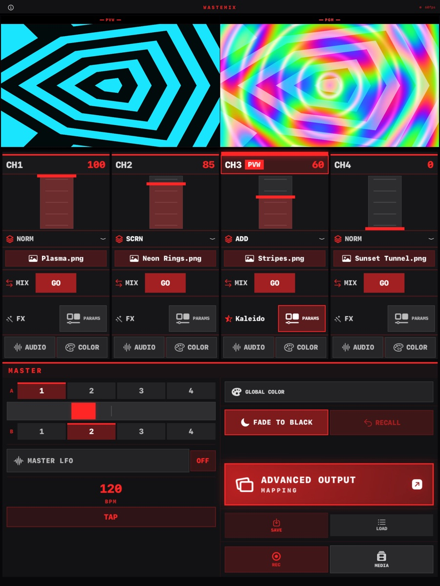

# WasteMix

Real-time 4-channel video mixer with NDI I/O, projection mapping, and live effects. Built for VJ performance.

## Features



### Mixer
- 4 independent video channels with vertical faders
- 33 blend modes (Normal, Add, Screen, Multiply, Difference, Hard Mix, Glow, HSL modes, and more)
- Multi-select A/B crossfader
- Per-channel transitions: Mix, Cut, Dip to Black, and 10 wipes
- Preview (PVW) and Program (PGM) monitors
- Tap tempo, Fade to Black and Recall
- First source on an empty mixer raises its fader automatically

### Effects
- 20 real-time GPU effects: Rotate, Mirror H/V, Invert, Mosaic, Strobe, Posterize, Blur, Solarize, Edges, Datamosh, Scanlines, Kaleidoscope, Halftone, Feedback, Wave, Tunnel, Channels, Displace, Thermal
- Per-channel freeze frame
- Luma key and chroma key
- Picture-in-Picture (PIP) with scale, position and rotation
- Per-channel and global color correction (brightness, contrast, saturation, hue, RGB gain, lift)

### Modulation
- Per-channel LFOs and a master LFO: sine, triangle, square, sawtooth, random
- BPM-synced modulation
- Audio reactivity with 7-band EQ (Sub Bass through Brilliance)
- Quick presets: Kick, Bass, Vocal, Hats, Full

### Input Sources
- iPad cameras (front/back)
- USB/HDMI capture cards and webcams (UVC) over USB-C
- NDI® network sources (auto-discovery)
- Video files (MP4, MOV, M4V) and images (JPG, PNG, HEIF) from Photos
- 15 audio visualizer styles
- Solid colors and test patterns (Color Bars, Gradient, Checkerboard)

### Output
- NDI® output (global program feed + per-screen sends)
- External display output via HDMI/USB-C with fullscreen support
- Advanced Output for projection mapping:
  - Multi-screen, multi-slice output
  - Per-slice mesh warp with draggable grid nodes
  - Corner-pin perspective warping
  - Soft edge blending for multi-projector setups
  - Free transform (move, resize, rotate)
  - 1920x1080 render resolution
- Record program output to Photos

### Presets
- Save and load full mixer state
- Per-channel settings preserved

## App Store

Version 1.0 (build 11) was submitted for review on 2026-09-28 (iPad only).

- Listing copy, review notes and App Store Connect answers: [`store/APP_STORE_LISTING.md`](store/APP_STORE_LISTING.md)
- Screenshots (iPad 13", 2064 × 2752, no alpha): [`store/screenshots/`](store/screenshots/)
- Privacy policy and support pages: [videowaste.github.io/WasteMix](https://videowaste.github.io/WasteMix/) (source in `docs/`)
- Regenerate screenshots in the Simulator: `tools/screenshots/shoot.sh <simulator-udid>` (uses the Debug-only `-WMDemo` launch argument)

## Build

### macOS (Mac Catalyst)

Requires Xcode 15+ and macOS 17+.

```bash
cd QuadMix
xcodebuild -project QuadMix.xcodeproj \
  -scheme QuadMix \
  -destination 'platform=macOS,variant=Mac Catalyst' \
  -derivedDataPath build \
  build
open build/Build/Products/Debug-maccatalyst/WasteMix.app
```

### NDI Support

1. Download and install the free [NDI SDK for Apple](https://ndi.video/for-developers/ndi-sdk/)
   (installs to `/Library/NDI SDK for Apple`)
2. Build with `ENABLE_NDI=1` (already set in build settings). iOS links
   `libndi_ios.a`; Mac Catalyst embeds `libndi.dylib` via a build phase.

### Windows (DirectX)

See `WasteMixWindows/` for the DirectX/C++ build. Requires Visual Studio 2022 with C++ desktop development workload.

## Architecture

- **Metal** rendering pipeline with compute shaders for all effects
- **CVMetalTextureCache** for zero-copy camera/video frame conversion
- **Triple-buffered** render loop at 60fps
- **CVPixelBufferPool** for NDI receive (no per-frame allocation)
- **SwiftUI** interface with Mac Catalyst support
- Liquid UI scaling — adapts to any window size

## License

WasteMix is open source under the [MIT License](LICENSE).

**Note on NDI:** The NDI® SDK (headers and libraries from Vizrt NDI AB) is a
proprietary dependency and is **not** included in this repository. Its license
does not permit redistribution. To build with NDI support, download the NDI SDK
separately from [ndi.video](https://ndi.video/) and follow the NDI Support
instructions above. NDI® is a registered trademark of Vizrt NDI AB.
